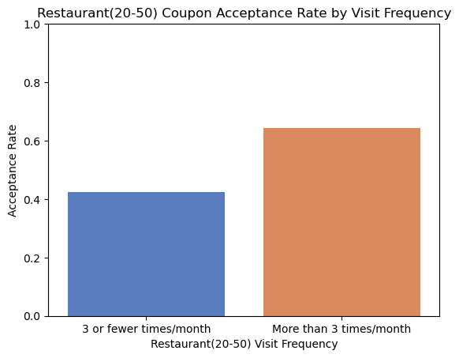
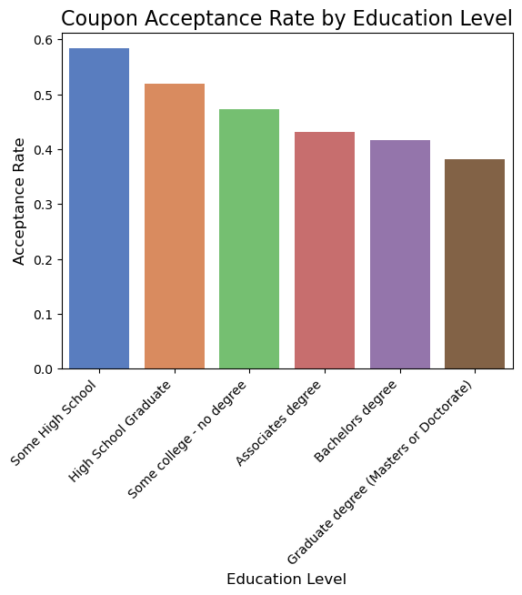
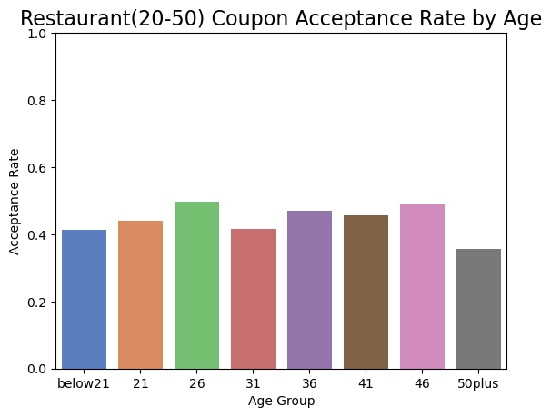
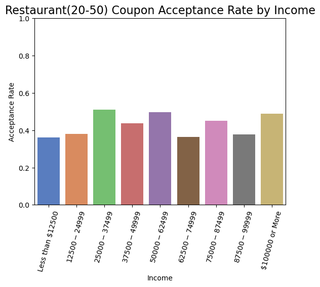

# More Expensive Restaurant ($20-$50) Coupon Acceptance Analysis
## Overview
This report summarizes the key differences between customers who accepted and did not accept coupons for restaurants in the $20-$50 price range. This analysis is based on data from the UCI Machine Learning Repository. The survey presented participants with various driving scenarios and asked about their likelihood of accepting a coupon while driving.

## Key Findings
### 1. Overall Acceptance Rate
- The overall acceptance rate for Restaurant($20-$50) coupons was: 44.10%
### 2. Frequency of Restaurant Visits
- Customers who frequently visit restaurants in the $20-$50 range were more likely to accept coupons.

- Acceptance rate for those visiting more than 3 times a month: 64.23%
- Acceptance rate for those visiting 3 or fewer times a month: 42.29%
### 3. Education Level
- Customers with higher education levels had lower coupon acceptance rates.

### 4. Age
- Younger adults (21-31) were more likely to accept coupons compared to older age groups. 
- The 50+ age group had the lowest acceptance rate.

### 5. Income
- Low to Middle-income groups ($25,000 - $87,499) showed higher acceptance rates.

- Highest acceptance income group: [$25,000 - $37,499]
- Lowest acceptance income group: [Less than $12,500]

## Next Steps and Recomendations

1. **Target Demographic**: The ideal customer for more expensive restaurant ($20-$50) coupons appears to be young to middle-aged adults with mid-range incomes and less education experience.

2. **Frequency Matters**: Regular customers of more expensive restaurants are more likely to accept coupons.